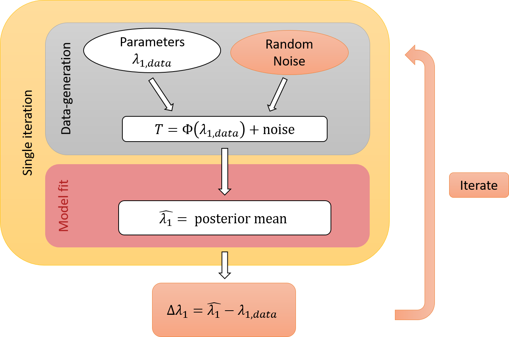
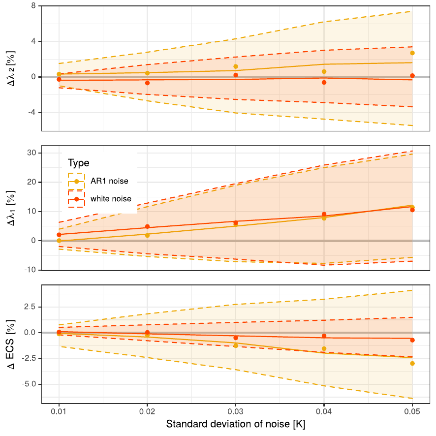

```{r setup, include = FALSE}
knitr::opts_chunk$set(
  collapse = TRUE,
  comment = "#>",
  fig.width = 7,
  fig.height = 5
)
library(ClimBayes)
```

## Intro

The Bayesian parameter estimates are sensitive to noise in the observation and forcing data, however, our package can be used to understand these dependencies. To this end, this package contains two functions `noise_sens_single_it` and `noise_sensitivity`, explained here:

{width=500px}

As outlined in the above figure, synthetic data is first created using the EBM solution with parameter $\lambda_{1, \text{data}}$ and additional random noise (grey box). Second, we fit the EBM to this synthetic data (red box) and consider the posterior mean as our parameter estimate $\hat{\lambda_1}$. The latter might differ from the true $\lambda_{1, \text{data}}$ due to the added noise. These two steps are implemented by `noise_sens_single_it` (see yellow box) and represent one iteration.
Yet, the result will depend on the single realization of the noise. To overcome this limitation, it is necessary to repeat the fit with sampled noise. `noise_sensitivity` performs this iteration and stores the estimated deviation $\Delta \lambda_1 = \hat{\lambda_1} - \lambda_{1,\text{data}}$ after each step (orange boxes).

## Example

As an example, we use a simple step-function to demonstrate the two functions.
We define a forcing time series and variables for the data generation that serve as input to `noise_sens_single_it`. In addition, we specify the standard deviation (SD) of the added noise (white noise and AR(1) process). The function return the result of the fit to the synthetic data.

```{r} 
forc = c(0, numeric(99) + 10)
vars = list(lambda = 0.1, weights = 1, Cap = 10.1, F0 = 0)
res_list <- noise_sens_single_it(forc, vars,
           sd_white = 0.5, sd_ar1 = 0.1,
           config_file = "../ebm_fit_config_noise_sens.yml")
print(res_list)
plot(res_list)
```

Next, we call `noise_sensitivity` to repeat this fit. This function can not only take a single value for the SDs of the noise, but also a list. In this way, we can test the effect of different noise amplitudes. We specify 10 iterations (`reps = 10`).
The output is a data frame with rows corresponding to the choice of the SD and the iteration steps. Here, we have two values for `sd_white` and 20 reps, hence the output will have 40 rows. Depending on your computer, repeating this experiment might take a few minutes. We pre-saved the output in `"data/results_noise_sensitivity.rda"`.

```{r, eval = FALSE}
results <- noise_sensitivity(sd_white_list = c(0.1, 0.5), 
                             sd_ar1_list = 0, 
                             reps = 20, 
                             forc = forc, 
                             vars = vars,
                             config_file = "../ebm_fit_config_noise_sens.yml")
```

```{r, include = FALSE}
# save(results, file = "data/results_noise_sensitivity.rda")
load("data/results_noise_sensitivity.rda")
```

```{r}
print(results)
```
To illustrate the results, consider the following histogram:
```{r}
  ggplot2::ggplot(results, ggplot2::aes(x = delta_lambda1, 
                                        fill = as.factor(sd_white),
                                        col = as.factor(sd_white))) +
  ggplot2::geom_histogram(bins = 6, position = "identity", alpha = 0.5) +
  ggplot2::theme_bw() +
  ggplot2::labs(fill = "SD of white noise") + 
  ggplot2::guides(col = "none")
```

We see that both positive and negative deviations $\Delta \lambda_1$ occur, i.e. $\lambda$ can be under- and overestimated depending on the noise. On average, the error is near zero. For higher noise levels (`sd_white = 0.5`), the deviation increases. This is as expected as increased noise likely influenced the Bayesian esimation more strongly.

## Results

The above functions can be applied to any forcing and number of boxes. 
Here, we use historical forcing from 1850-2000 and the two-box model.
We choose the data-generating parameters as parameter estimates from fitting the model to HadCRUT observations. Further, we change the values $\Delta \lambda_i$ to relative deviations (as percentage of the true value) and consider the equilibrium climate sensitivity (ECS), too. 

The following plot presents the results:

{width=500px}

It shows the spread of relative errors after 150 iterations of varying standard deviation. The dots and solid line present the median relative errors. Dashed lines show the first and third quartiles. Lines are computed from the `loess`-function in R. Colors indicate the type of the noise added: white or correlated AR(1) noise.

Key findings from this plot are:

- Higher levels of noise (i.e. higher SD on the x-axis) leads to a higher probability of larger deviations (wider spread of the curves)

- Correlated noise (yellow, AR(1) noise) has a larger influence on $\lambda_1$ (the slow feedback) than white noise (orange, white noise)

- For the fast feedback parameter $\lambda_2$, the type of noise has no detectable influence

- The ECS behaves similar to $\lambda_1$
